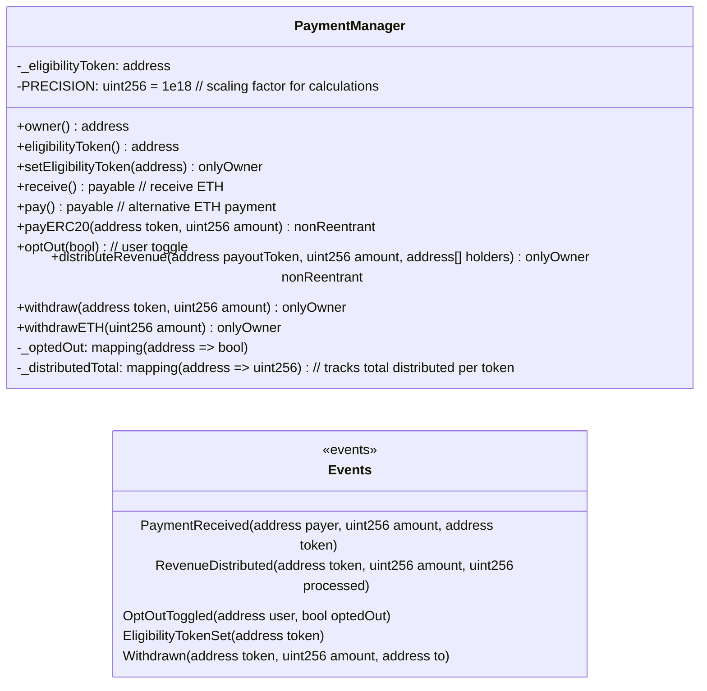
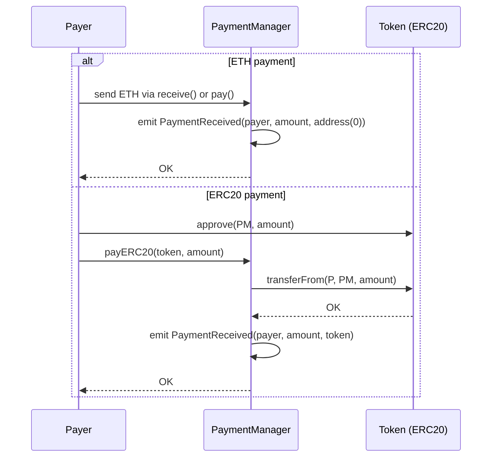
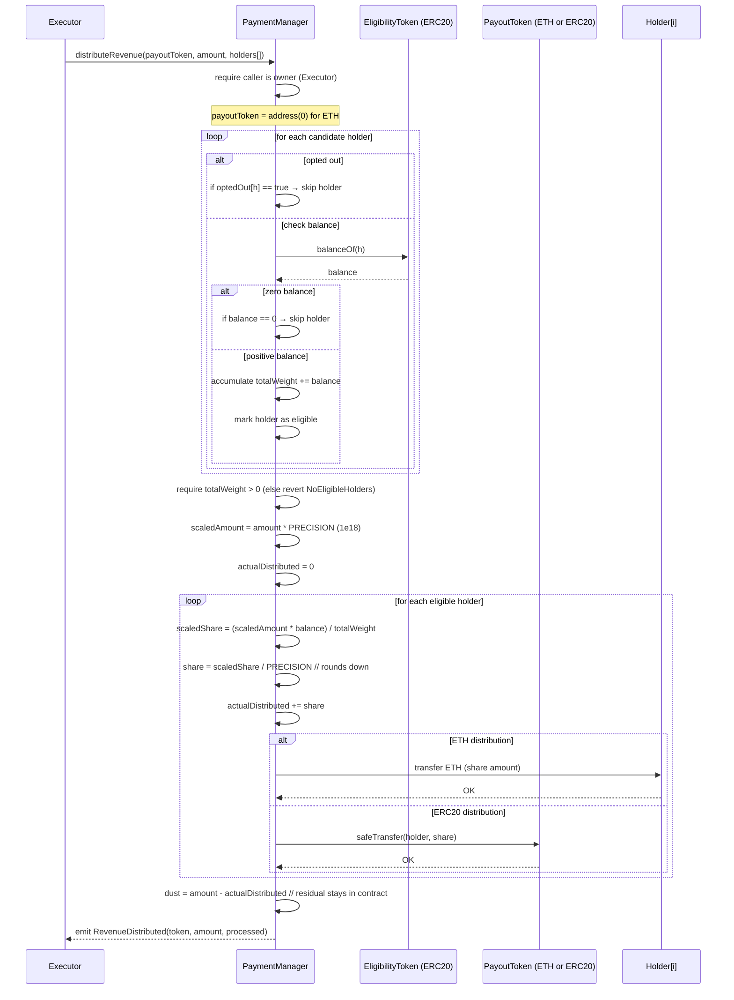
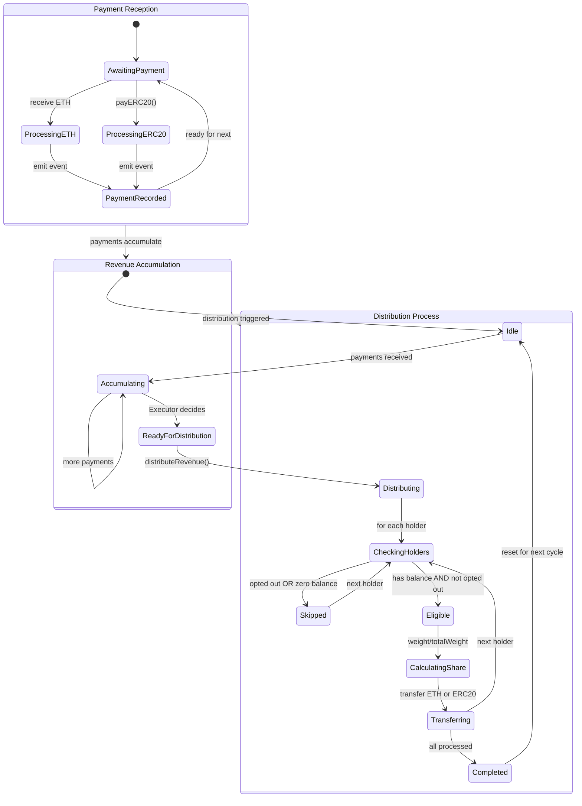

# Technical Spec — PaymentManager (Direct Payments + RevShare)

## 1. Background

### Problem Statement
The Perpetual Organization Architect (POA) ecosystem currently manages tasks, education modules, and participation tokens through separate contracts (TaskManager, EducationHub, ParticipationToken). However, organizations need an additional revenue layer to:

- **Accept External Revenue**: Organizations need a simple way to receive payments from any source
- **Accept Diverse Payments**: Support both ETH and various ERC-20 tokens without restrictions
- **Revenue Sharing**: Automatically distribute accumulated revenue to active participants based on their ParticipationToken holdings
- **Integration with POA**: Seamlessly integrate with the existing Executor pattern and ParticipationToken ecosystem

Current limitations:
- TaskManager handles internal bounties but not external revenue
- No mechanism for organizations to receive and distribute arbitrary payments
- Revenue generated outside the task system cannot be automatically distributed
- No opt-out mechanism for members who don't want revenue distributions

The PaymentManager fills this gap by providing a simple payment reception and distribution layer that connects external revenue to the internal ParticipationToken economy, allowing organizations to operate sustainable business models while maintaining decentralized governance and fair value distribution.

### Context / History
The POA system architecture includes:
- **OrgRegistry**: Central registry for organizations and their deployed contracts
- **Executor**: Batch executor that handles privileged operations via governance
- **ParticipationToken**: ERC-20 token minted for task completion and education modules
- **TaskManager**: Manages project tasks with bounty payouts in participation tokens
- **EducationHub**: Rewards learning module completion with participation tokens
- **Hats Protocol Integration**: Role-based access control throughout the system

Common patterns used: OpenZeppelin Ownable, AccessControl, ReentrancyGuard, Pausable, IERC20, SafeERC20, and upgradeable proxy patterns via beacons.

Similar payment/royalty splits exist (e.g., streaming splits), but this contract needs:
- Snapshot-at-call eligibility checks based on ParticipationToken balances
- Opt-out controls for members who don't want distributions
- Integration with the existing POA governance and role system

### Stakeholders
- **External Payers**: Anyone sending payments to the organization
- **Organization Members**: ParticipationToken holders eligible for revenue distributions
- **Executor Contract**: The organization's governance contract that owns and manages the PaymentManager
- **Token Ecosystem**:
  - Payment tokens: ETH and various ERC-20s accepted as payments
  - ParticipationToken: The organization's internal token used for revenue distribution weights

## 2. Motivation

### Goals & Success Stories

- Accept direct payments in ETH or any ERC-20 token without restrictions
- Emit payment events for transparency and tracking
- Periodic revenue distribution to current holders of a chosen eligibility token (configurable `eligibilityToken`), weighted by balances at distribution time
- **Opt-out**: any address can opt out of revenue shares
- **Access-controlled distribution**: only the Executor (owner) can initiate `distributeRevenue(token, amount, holders[])`
- **Safety**: skip recipients with zero eligibility balance or who opted out; use pull-over-push (optional) or safe push transfers with SafeERC20

**Success looks like**: A POA organization receiving payments from various sources (grants, donations, client payments, etc.), with revenue automatically flowing to active contributors based on their ParticipationToken holdings earned through completed tasks and education modules. This creates a sustainable economic loop where internal work (tasks/learning) translates to external revenue share.

## 3. Scope and Approaches

### Non-Goals

| Item (Non-Goal) | Reasoning for being off scope | Tradeoffs |
|-----------------|-------------------------------|-----------|
| Payment validation/restrictions | Reduces flexibility | Accept any payment amount from anyone |
| Streaming payments | Different lifecycle and continuous accrual | Periodic batch is cheaper and simpler |
| Snapshotting past balances | Requires checkpoints/snapshots | We weight by live balances at distribution call |
| Fee splitting by vesting / cliffs | Adds state and complexity | Keep MVP minimal, add later if needed |
| Cross-chain payments | Bridge risk, added complexity | MVP is single-chain |

### Value Proposition

| Technical Functionality | Value | Tradeoffs |
|------------------------|-------|-----------|
| Direct payment acceptance | Simple, unrestricted revenue collection | No payment validation or categorization |
| Payment recording (events only) | Auditable sales ledger | Gas efficient, no storage growth |
| Pro-rata revshare by eligibility token balance | Aligns incentives, easy to reason about | Balance measured at call time, no historical snapshots |
| Opt-out toggle | Respects participant preference | Additional check each distribution |
| Executor-only distribution | Maximum security | Less flexibility |
| ETH and ERC-20 payment support | Maximum flexibility for buyers | Additional logic for handling ETH |

### Alternative Approaches

| Technical Functionality | Pros | Cons |
|------------------------|------|------|
| Equal split among eligible holders | Simple math | Unfair to larger contributors; gaming risk |
| Snapshot-based weighting (ERC20Votes) | Fair wrt block height | Requires snapshot token or custom snapshots |
| Pull payments (claim) | Avoids reentrancy/loops | Requires per-user claim flow; more UX frictions |
| Pausable | Emergency stop | Extra role and checks; optional |

### Relevant Metrics

- Payment success rate, failed txs
- Gas per purchase/distribution
- Number of skipped recipients (zero balance or opted-out)
- Total revenue distributed vs retained
- Time between distributions

## 4. Step-by-Step Flow

### 4.1 Main ("Happy") Path — Receiving Payment (ETH or ERC-20)

1. **Pre-condition**: PaymentManager contract is deployed
2. **Actor**: Any external payer sends payment
3. **Payment methods**:
   - **ETH**: Payer sends ETH directly to contract via `receive()` or `pay()` function
   - **ERC-20**: Payer calls `payERC20(token, amount)` after approving token transfer
4. **System emits**:
   - Emit `PaymentReceived(payer, amount, token, timestamp)`
5. **Post-condition**: Contract balance (ETH or ERC-20) increases

### 4.1b Main Path — Distribute Revenue

1. **Pre-condition**: Executor is the owner. Contract holds payoutToken balance ≥ amount. eligibilityToken is set
2. **Actor**: Executor calls `distributeRevenue(payoutToken, amount, holders[])`
3. **System validates**:
   - `amount > 0`, holders array non-empty
   - For each h in holders:
     - If `optedOut[h] == true` → skip
     - Read `bal = IERC20(eligibilityToken).balanceOf(h)`. If `bal == 0` → skip
   - Sum weights `W = Σ bal(h)` over non-skipped. If `W == 0` → revert `NoEligibleHolders()`
4. **System computes / emits**:
   - Scale amount with PRECISION constant (1e18) for accurate calculations
   - For each eligible h: `scaledShare = (amount * PRECISION * bal(h)) / W`
   - Actual share: `share = scaledShare / PRECISION` (rounds down)
   - Transfer share via SafeERC20 to h
   - Track `distributedTotal[payoutToken] += actualDistributed`
   - Emit `RevenueDistributed(payoutToken, amount, holdersProcessed)`
5. **Post-condition**: Payout sent; skipped addresses received nothing

### 4.2 Alternate / Error Paths

| # | Condition | System Action | Suggested Handling |
|---|-----------|---------------|-------------------|
| A1 | Zero payment amount | revert `ZeroAmount()` | Send non-zero amount |
| A2 | ERC-20 approval insufficient | revert `InsufficientAllowance()` | Ensure proper approval |
| A3 | ERC-20 transferFrom fails | revert with OZ error | Ensure allowance & balance |
| A4 | Distribution: zero amount or no holders | revert `InvalidDistributionParams()` | Provide proper inputs |
| A5 | No eligible holders (all zero balance or opted out) | revert `NoEligibleHolders()` | Retry later or different set |
| A6 | Insufficient payout token balance | revert `InsufficientFunds()` | Fund contract first |
| A7 | Payout transfer failure | SafeERC20 revert | Ensure payout token behaves per ERC-20 |
| A8 | Reentrancy attempt | blocked by nonReentrant | N/A |
| A9 | Distribution rounding dust | Small residual remains in contract | Accumulates for next distribution |

## 5. UML Diagrams (Mermaid)

### 5.1 Class Diagram

### 5.2 Payment Flow

### 5.3 Distribution Flow

### 5.4 High-Level State Diagram (Payment & Revenue Lifecycle)

## 6. Edge Cases and Concessions

- **Token Decimal Restriction**: Only 18-decimal tokens are supported for eligibility token (ParticipationToken). *Rationale*: PRECISION constant (1e18) assumes 18 decimals for accurate distribution calculations
- **Large holder arrays**: Gas may be high for big batches. *Concession*: allow chunked distributions; add maxBatchSize guidance in runbook
- **Eligibility flapping**: Eligibility is checked at call time; balances can change mid-tx only via reentrancy (blocked)
- **Non-standard ERC-20s**: Use SafeERC20; still possible odd tokens (e.g., fee-on-transfer). Document compatibility
- **Payment token decimals**: Prices are set in smallest units of the configured token; UI must format
- **Opt-out defaults**: Default is opted-in (`optedOut=false`). Users call `optOut(true)` to stop receiving
- **Reentrancy**: Guard purchase/distribution with `nonReentrant`
- **Access control**: Only Executor (as owner) can trigger distributions and withdrawals
- **Pausable (optional)**: If desired, wrap purchase/distribute with `whenNotPaused`

## 7. Design Decisions

Based on POA architecture requirements:
- **Eligibility Token**: Will accept any ERC-20 as eligibility token for flexibility (typically ParticipationToken)
- **No Restrictions**: Anyone can send payments; no validation or categorization
- **Executor as Owner**: The Executor contract will be the sole owner with all admin privileges
- **Standalone Deployment**: PaymentManager will not register with OrgRegistry, deployed as independent contract
- **Event-Based Tracking**: All payments tracked via events for gas efficiency
- **No Cross-Module Integration**: PaymentManager operates independently, no automatic minting or task creation

## 8. Open Questions

1. **Distribution Automation**: Should distributions be triggerable by anyone (with proper checks) or strictly controlled by Executor only?
2. **Pausable**: Include Pausable functionality now or add later if needed?

## 8. Glossary / References

### Terms
- **Eligibility Token** — The ERC-20 whose current balances determine distribution weights (typically ParticipationToken in POA)
- **Payout Token** — The ERC-20 sent out during a distribution call (`distributeRevenue`)
- **Payment Token** — The token received as payment (ETH represented as address(0), or ERC-20 address)
- **ParticipationToken** — POA's native token earned through task completion and education modules
- **Executor** — The POA governance contract that executes privileged operations
- **Hats Protocol** — Role-based permission system integrated throughout POA

### Links / References
- OpenZeppelin Contracts: Ownable, AccessControl, ReentrancyGuard, IERC20, SafeERC20
- POA Contracts: OrgRegistry, Executor, ParticipationToken, TaskManager, EducationHub
- Hats Protocol: Used for role-based access control across the POA ecosystem