# Technical Spec — PaymentManager (Services + RevShare)

## 1. Background

### Problem Statement
The Perpetual Organization Architect (POA) ecosystem currently manages tasks, education modules, and participation tokens through separate contracts (TaskManager, EducationHub, ParticipationToken). However, organizations need an additional revenue layer to:

- **Monetize Services**: Organizations need to offer paid services/products to external users beyond just internal task rewards
- **Accept Diverse Payments**: Support both ETH and various ERC-20 tokens as payment methods for different services
- **Revenue Sharing**: Automatically distribute accumulated revenue to active participants based on their ParticipationToken holdings
- **Integration with POA**: Seamlessly integrate with the existing Hats Protocol roles, Executor pattern, and ParticipationToken ecosystem

Current limitations:
- TaskManager handles internal bounties but not external customer payments
- No mechanism for organizations to sell services/products to non-members
- Revenue generated outside the task system cannot be automatically distributed
- No opt-out mechanism for members who don't want revenue distributions

The PaymentManager fills this gap by providing a service marketplace layer that connects external revenue to the internal ParticipationToken economy, allowing organizations to operate sustainable business models while maintaining decentralized governance and fair value distribution.

### Context / History
The POA system architecture includes:
- **OrgRegistry**: Central registry for organizations and their deployed contracts
- **Executor**: Batch executor that handles privileged operations via governance
- **ParticipationToken**: ERC-20 token minted for task completion and education modules
- **TaskManager**: Manages project tasks with bounty payouts in participation tokens
- **EducationHub**: Rewards learning module completion with participation tokens
- **Hats Protocol Integration**: Role-based access control throughout the system

Common patterns used: OpenZeppelin Ownable, AccessControl, ReentrancyGuard, Pausable, IERC20, SafeERC20, and upgradeable proxy patterns via beacons.

Similar payment/royalty splits exist (e.g., streaming splits), but this contract needs:
- Snapshot-at-call eligibility checks based on ParticipationToken balances
- Opt-out controls for members who don't want distributions
- Integration with the existing POA governance and role system

### Stakeholders
- **External Buyers/Clients**: Non-members purchasing services from the organization
- **Organization Members**: ParticipationToken holders eligible for revenue distributions
- **Executor Contract**: The organization's governance contract that owns and manages the PaymentManager
- **Distribution Operators**: Executor or addresses with DISTRIBUTOR_ROLE who can trigger revenue distributions
- **Token Ecosystem**:
  - Payment tokens: ETH and various ERC-20s accepted for service payments
  - ParticipationToken: The organization's internal token used for revenue distribution weights
  - Bounty tokens: External tokens that might be accepted as payment for premium services

## 2. Motivation

### Goals & Success Stories

- Publish multiple services with distinct prices and accepted currency (ETH or a specific ERC-20)
- Accept payments and immutably record each purchase
- Periodic revenue distribution to current holders of a chosen eligibility token (configurable `eligibilityToken`), weighted by balances at distribution time
- **Opt-out**: any address can opt out of revenue shares
- **Access-controlled distribution**: only OWNER or DISTRIBUTOR_ROLE can initiate `distributeRevenue(token, amount, holders[])`
- **Safety**: skip recipients with zero eligibility balance or who opted out; use pull-over-push (optional) or safe push transfers with SafeERC20

**Success looks like**: A POA organization selling consulting services, educational content, or digital products to external clients, with revenue automatically flowing to active contributors based on their ParticipationToken holdings earned through completed tasks and education modules. This creates a sustainable economic loop where internal work (tasks/learning) translates to external revenue share.

## 3. Scope and Approaches

### Non-Goals

| Item (Non-Goal) | Reasoning for being off scope | Tradeoffs |
|-----------------|-------------------------------|-----------|
| On-chain price oracles | Complexity & external dependencies | Simpler, but price must be set manually |
| Streaming payments | Different lifecycle and continuous accrual | Periodic batch is cheaper and simpler |
| Snapshotting past balances | Requires checkpoints/snapshots | We weight by live balances at distribution call |
| Fee splitting by vesting / cliffs | Adds state and complexity | Keep MVP minimal, add later if needed |
| Cross-chain payments | Bridge risk, added complexity | MVP is single-chain |

### Value Proposition

| Technical Functionality | Value | Tradeoffs |
|------------------------|-------|-----------|
| Service catalog with per-service currency & price | Flexible monetization | Slightly more storage per service |
| Payment recording (events + storage) | Auditable sales ledger | Storage growth over time |
| Pro-rata revshare by eligibility token balance | Aligns incentives, easy to reason about | Balance measured at call time, no historical snapshots |
| Opt-out toggle | Respects participant preference | Additional check each distribution |
| Access-controlled distribution | Operational safety | Role administration overhead |
| ETH and ERC-20 payment support | UX flexibility | More checks/branches in payment path |

### Alternative Approaches

| Technical Functionality | Pros | Cons |
|------------------------|------|------|
| Equal split among eligible holders | Simple math | Unfair to larger contributors; gaming risk |
| Snapshot-based weighting (ERC20Votes) | Fair wrt block height | Requires snapshot token or custom snapshots |
| Pull payments (claim) | Avoids reentrancy/loops | Requires per-user claim flow; more UX frictions |
| Pausable | Emergency stop | Extra role and checks; optional |

### Relevant Metrics

- Payment success rate, failed txs
- Gas per purchase/distribution
- Number of skipped recipients (zero balance or opted-out)
- Total revenue distributed vs retained
- Time between distributions

## 4. Step-by-Step Flow

### 4.1 Main ("Happy") Path — Buying a Service (ETH or ERC-20)

1. **Pre-condition**: Service S is `active=true`, with price p and paymentToken (address(0) for ETH)
2. **Actor**: User (Buyer) triggers `purchase(serviceId)`
3. **System validates**:
   - Service exists & active
   - Correct payment provided:
     - If ETH: `msg.value == price`
     - If ERC-20: user has approved `price` and transferFrom succeeds
4. **System persists / emits**:
   - Append `Payment{buyer, serviceId, price, paymentToken, timestamp}`
   - Emit `PaymentRecorded(...)`
5. **Post-condition**: Contract balance (ETH/ERC-20) increases; ledger updated

### 4.1b Main Path — Distribute Revenue

1. **Pre-condition**: Distributor has DISTRIBUTOR_ROLE or is owner. Contract holds payoutToken balance ≥ amount. eligibilityToken is set
2. **Actor**: Distributor calls `distributeRevenue(payoutToken, amount, holders[])`
3. **System validates**:
   - `amount > 0`, holders array non-empty
   - For each h in holders:
     - If `optedOut[h] == true` → skip
     - Read `bal = IERC20(eligibilityToken).balanceOf(h)`. If `bal == 0` → skip
   - Sum weights `W = Σ bal(h)` over non-skipped. If `W == 0` → revert `NoEligibleHolders()`
4. **System computes / emits**:
   - Scale amount with PRECISION constant (1e18) for accurate calculations
   - For each eligible h: `scaledShare = (amount * PRECISION * bal(h)) / W`
   - Actual share: `share = scaledShare / PRECISION` (rounds down)
   - Transfer share via SafeERC20 to h
   - Track `distributedTotal[payoutToken] += actualDistributed`
   - Track `accumulatedDust[payoutToken] += (amount - actualDistributed)`
   - Emit `RevenueDistributed(payoutToken, amount, holdersProcessed, skippedCount, dust)`
5. **Post-condition**: Payout sent; skipped addresses received nothing

### 4.2 Alternate / Error Paths

| # | Condition | System Action | Suggested Handling |
|---|-----------|---------------|-------------------|
| A1 | Service inactive or not found | revert `ServiceInactive()`/`InvalidService()` | Admin enable or create service |
| A2 | ETH payment mismatch | revert `InvalidPaymentValue()` | UI enforces exact value |
| A3 | ERC-20 transferFrom fails | revert with OZ error | Ensure allowance & balance |
| A4 | Distribution: zero amount or no holders | revert `InvalidDistributionParams()` | Provide proper inputs |
| A5 | No eligible holders (all zero balance or opted out) | revert `NoEligibleHolders()` | Retry later or different set |
| A6 | Insufficient payout token balance | revert `InsufficientFunds()` | Fund contract first |
| A7 | Payout transfer failure | SafeERC20 revert | Ensure payout token behaves per ERC-20 |
| A8 | Reentrancy attempt | blocked by nonReentrant | N/A |
| A9 | Distribution rounding dust | Dust tracked in accumulatedDust mapping | Owner can call sweepDust() to recover |

## 5. UML Diagrams (Mermaid)

### 5.1 Class Diagram

### 5.2 Purchase Flow

### 5.3 Distribution Flow

```mermaid
sequenceDiagram
    participant D as Distributor
    participant PM as PaymentManager
    participant ET as EligibilityToken (ERC20)
    participant RT as PayoutToken (ERC20)
    participant H as Holder[i]

    D->>PM: distributeRevenue(payoutToken, amount, holders[])
    PM->>PM: require caller has DISTRIBUTOR_ROLE or owner
    loop for each candidate holder
      alt opted out
        PM->>PM: if optedOut[h] == true → skip holder
      else check balance
        PM->>ET: balanceOf(h)
        ET-->>PM: balance
        alt zero balance
          PM->>PM: if balance == 0 → skip holder
        else positive balance
          PM->>PM: accumulate totalWeight += balance
          PM->>PM: mark holder as eligible
        end
      end
    end
    PM->>PM: require totalWeight > 0 (else revert NoEligibleHolders)
    PM->>PM: scaledAmount = amount * PRECISION (1e18)
    PM->>PM: actualDistributed = 0
    loop for each eligible holder
      PM->>PM: scaledShare = (scaledAmount * balance) / totalWeight
      PM->>PM: share = scaledShare / PRECISION  // rounds down
      PM->>PM: actualDistributed += share
      PM->>RT: safeTransfer(holder, share)
      RT-->>PM: OK
    end
    PM->>PM: dust = amount - actualDistributed
    PM->>PM: accumulatedDust[token] += dust
    PM-->>D: emit RevenueDistributed(token, amount, processed, skipped, dust)
```

### 5.4 High-Level State Diagram (Service & Revenue Lifecycle)

## 6. Edge Cases and Concessions

- **Token Decimal Restriction**: Only 18-decimal tokens are supported for eligibility token (ParticipationToken). *Rationale*: PRECISION constant (1e18) assumes 18 decimals for accurate distribution calculations
- **Large holder arrays**: Gas may be high for big batches. *Concession*: allow chunked distributions; add maxBatchSize guidance in runbook
- **Eligibility flapping**: Eligibility is checked at call time; balances can change mid-tx only via reentrancy (blocked)
- **Non-standard ERC-20s**: Use SafeERC20; still possible odd tokens (e.g., fee-on-transfer). Document compatibility
- **Payment token decimals**: Prices are set in smallest units of the configured token; UI must format
- **Opt-out defaults**: Default is opted-in (`optedOut=false`). Users call `optOut(true)` to stop receiving
- **Reentrancy**: Guard purchase/distribution with `nonReentrant`
- **Access roles**: Owner grants/revokes DISTRIBUTOR_ROLE
- **Pausable (optional)**: If desired, wrap purchase/distribute with `whenNotPaused`

## 7. Design Decisions

Based on POA architecture requirements:
- **Eligibility Token**: Will accept any ERC-20 as eligibility token for flexibility (typically ParticipationToken)
- **No Hats Integration**: Service management will be controlled solely by the Executor/owner, no Hat roles needed
- **Executor as Owner**: The Executor contract will be the sole owner with all admin privileges
- **Standalone Deployment**: PaymentManager will not register with OrgRegistry, deployed as independent contract
- **No Revenue Caps**: No per-project or per-service revenue caps will be implemented
- **Event-Based Metadata**: Service metadata will be emitted in events rather than stored on-chain (following EducationHub pattern)
- **No Cross-Module Integration**: PaymentManager operates independently, no automatic minting or task creation

## 8. Open Questions

1. **Distribution Automation**: Should distributions be triggerable by anyone (with proper checks) or strictly controlled by Executor/DISTRIBUTOR_ROLE?
2. **Treasury Sweep**: Should accumulated dust be automatically sent to a treasury address or require manual sweeping by owner?
3. **Pausable**: Include Pausable functionality now or add later if needed?

## 8. Glossary / References

### Terms
- **Eligibility Token** — The ERC-20 whose current balances determine distribution weights (typically ParticipationToken in POA)
- **Payout Token** — The ERC-20 sent out during a distribution call (`distributeRevenue`)
- **Payment Token** — The token users pay with for a given service (ETH or ERC-20)
- **ParticipationToken** — POA's native token earned through task completion and education modules
- **Executor** — The POA governance contract that executes privileged operations
- **Hats Protocol** — Role-based permission system integrated throughout POA

### Links / References
- OpenZeppelin Contracts: Ownable, AccessControl, ReentrancyGuard, IERC20, SafeERC20
- POA Contracts: OrgRegistry, Executor, ParticipationToken, TaskManager, EducationHub
- Hats Protocol: Used for role-based access control across the POA ecosystem