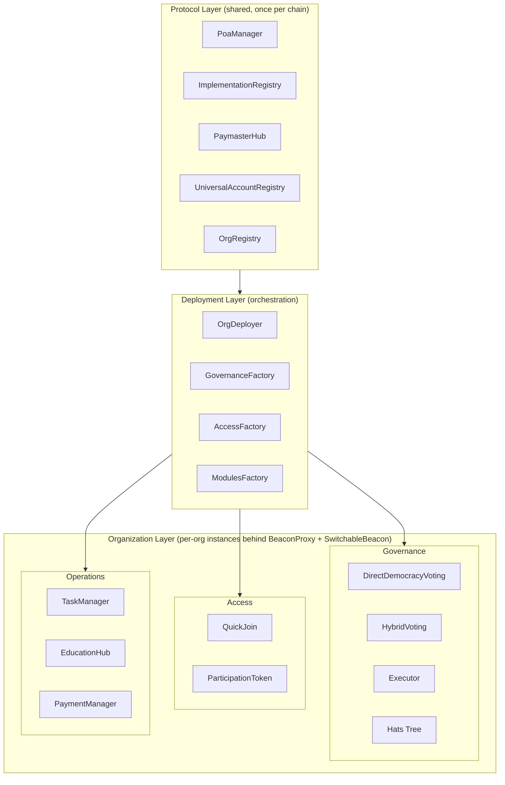
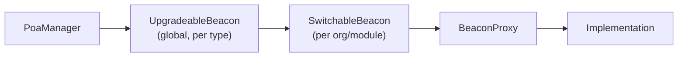
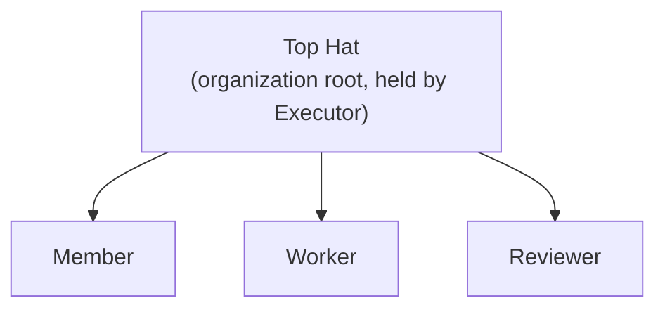

# Perpetual Organization Protocol (POP)

> Smart contracts for worker-owned, on-chain organizations.

[](LICENSE)
[](https://github.com/poa-box/POP/actions/workflows/ci.yml)
[](https://soliditylang.org)
[](https://getfoundry.sh)
[](slither.config.json)

POP is the contract layer for **Poa**, a no-code DAO builder for community- and worker-owned organizations. Members earn governance through contribution, not capital: every approved task mints non-transferable participation tokens to the worker who did the work. Decisions happen on-chain across multiple weighted voting classes, role assignments use [Hats Protocol](https://hatsprotocol.xyz), and gas is sponsored via a multi-tenant ERC-4337 paymaster with a built-in solidarity fund.

This repository is the Solidity protocol: ~9.2K LOC of core contracts, 40+ test suites, mainnet on Arbitrum and Gnosis. If you're new here, start with [`docs/POP_OVERVIEW.md`](docs/POP_OVERVIEW.md) for the protocol philosophy, then come back here for the technical map.

---

## Table of Contents

1. [The POP Stack](#the-pop-stack)
2. [Live Deployments](#live-deployments)
3. [Why POP Exists](#why-pop-exists)
4. [Architecture](#architecture)
5. [Module Reference](#module-reference)
6. [Upgradeability (SwitchableBeacon)](#upgradeability-switchablebeacon)
7. [Storage Model (ERC-7201)](#storage-model-erc-7201)
8. [Access Control (Hats Protocol)](#access-control-hats-protocol)
9. [Account Abstraction (ERC-4337)](#account-abstraction-erc-4337)
10. [Cross-Chain (Hyperlane)](#cross-chain-hyperlane)
11. [The Subgraph](#the-subgraph)
12. [The Frontend](#the-frontend)
13. [The CLI](#the-cli)
14. [Quick Start](#quick-start)
15. [Building & Testing](#building--testing)
16. [Deploying](#deploying)
17. [Security Model](#security-model)
18. [Contributing](#contributing)
19. [Documentation Index](#documentation-index)
20. [Community](#community)
21. [License](#license)

---

## The POP Stack

POP is split across four repositories. Changes to event signatures or storage layouts in this repo ripple into the subgraph and the frontend; coordinate accordingly (see [Contributing](#contributing)).

| Repo | Role | Tech |
|------|------|------|
| **[poa-box/POP](https://github.com/poa-box/POP)** *(this repo)* | Solidity protocol contracts | Foundry · Solidity `^0.8.20`–`^0.8.30` |
| **[poa-box/subgraph-pop](https://github.com/poa-box/subgraph-pop)** | The Graph indexer turning POP events into a GraphQL API | TypeScript · AssemblyScript · Graph CLI |
| **[poa-box/Poa-frontend](https://github.com/poa-box/Poa-frontend)** | Next.js web app at [poa.box](https://poa.box) | Next.js 14 · wagmi · RainbowKit · viem · Apollo · Pimlico |
| **[poa-box/poa-cli](https://github.com/poa-box/poa-cli)** | CLI and autonomous-agent framework | TypeScript |

All four repos are AGPL-3.0.

---

## Live Deployments

**Mainnet:** Arbitrum One (chain `42161`), Gnosis (chain `100`).
**Testnets:** Sepolia (`11155111`), Base Sepolia (`84532`), Optimism Sepolia (`11155420`), Arbitrum Sepolia (`421614`), Hoodi (`560048`).

The canonical, current set of protocol-layer addresses for each chain lives in [`script/config/infrastructure.json`](script/config/infrastructure.json) and is automatically loaded by `DeployOrg.s.sol`. There is no need to copy addresses by hand. A snapshot of the testnet infrastructure addresses:

| Contract | Address |
|----------|---------|
| OrgDeployer | `0x888daCE32d8BCdDD95BA9D490643663C25810ded` |
| PoaManager | `0x868680dc2689fa49A8389b0313da15408C8BE340` |
| OrgRegistry | `0xBBf72057901d7d0F557D6f7Aa1Afc56F4F3d6072` |
| ImplementationRegistry | `0xe848C652e1Aa56BeC38f504259f5D2b98b585aed` |
| PaymasterHub | `0xbe2c8713F762871b14dc2273B389a210974dB755` |
| UniversalAccountRegistry | `0xDdB1DA30020861d92c27aE981ac0f4Fe8BA536F2` |
| GovernanceFactory | `0x2e3BCa0b6902285b7e8D747A14f118EbB8DB997D` |
| AccessFactory | `0x05Db5Cf1540683A888E7aC656d7373aa03864a8c` |
| ModulesFactory | `0x0b5b1410E6e8FeE4eCd07C69CdDCf860eCc44981` |
| HatsTreeSetup | `0xdc7C14AB68fcCf9bcD255f5be684EbDc892Da13a` |
| Hats Protocol (external) | `0x3bc1A0Ad72417f2d411118085256fC53CBdDd137` |

Always treat `script/config/infrastructure.json` as the source of truth. This table can drift between releases.

---

## Why POP Exists

- **Work creates ownership.** Participation tokens are minted on approved task completion and are non-transferable. You earn ownership through contribution; you cannot buy in.
- **One member, one voice (when it matters).** `DirectDemocracyVoting` enforces 100 voting points per eligible member. Wealth cannot tilt the outcome.
- **Multiple stakeholders, proportional voice.** `HybridVoting` composes weighted classes (e.g., 50% direct democracy, 50% token-weighted with optional quadratic) so organizations can balance constituencies.
- **Collective infrastructure, individual autonomy.** Orgs share an upgrade beacon, an account registry, and a paymaster with a solidarity fund, while each org governs itself and can pin to a specific implementation at any time.
- **Transparency by default.** Proposals, votes, tasks, payments and role assignments are all on-chain. The subgraph turns those events into a queryable history.

Read [`docs/POP_OVERVIEW.md`](docs/POP_OVERVIEW.md) for the long version.

---

## Architecture

POP organizations are deployed atomically by composing three layers of contracts. The protocol layer is shared across all orgs on a chain; the deployment layer creates new orgs in a single transaction; each organization owns its own per-org instances of the modules.



**Protocol Layer** (deployed once per chain, persistent, upgradeable, shared):

| Contract | Path | Purpose |
|----------|------|---------|
| `PoaManager` | [`src/PoaManager.sol`](src/PoaManager.sol) | Owns the global `UpgradeableBeacon` instances per contract type. Single upgrade authority. |
| `ImplementationRegistry` | [`src/ImplementationRegistry.sol`](src/ImplementationRegistry.sol) | Records every implementation version registered with the protocol. |
| `OrgRegistry` | [`src/OrgRegistry.sol`](src/OrgRegistry.sol) | Enumerates every deployed organization and its module addresses. |
| `UniversalAccountRegistry` | [`src/UniversalAccountRegistry.sol`](src/UniversalAccountRegistry.sol) | Cross-org username + account mapping (one identity, many orgs). |
| `PaymasterHub` | [`src/PaymasterHub.sol`](src/PaymasterHub.sol) | Multi-tenant ERC-4337 paymaster with a solidarity fund. |

**Deployment Layer** (also deployed once per chain; orchestration only):

| Contract | Path | Purpose |
|----------|------|---------|
| `OrgDeployer` | [`src/OrgDeployer.sol`](src/OrgDeployer.sol) | Atomic full-org deployment in one transaction (~22.5M gas). |
| `GovernanceFactory` | [`src/factories/GovernanceFactory.sol`](src/factories/GovernanceFactory.sol) | Deploys `Executor`, `HybridVoting`, `DirectDemocracyVoting`, and coordinates the org's Hats tree via `HatsTreeSetup`. |
| `AccessFactory` | [`src/factories/AccessFactory.sol`](src/factories/AccessFactory.sol) | Deploys `QuickJoin` and `ParticipationToken`. |
| `ModulesFactory` | [`src/factories/ModulesFactory.sol`](src/factories/ModulesFactory.sol) | Deploys `TaskManager`, `EducationHub`, `PaymentManager`. |
| `HatsTreeSetup` | [`src/HatsTreeSetup.sol`](src/HatsTreeSetup.sol) | Helper called by `GovernanceFactory` to mint the top hat and role hats during deployment. |

**Organization Layer** (per-org instances behind `BeaconProxy` + `SwitchableBeacon`):

| Contract | Path | Purpose |
|----------|------|---------|
| `Executor` | [`src/Executor.sol`](src/Executor.sol) | Sole call-execution layer; only the authorized voting contract may invoke `execute()`. Ownership renounced after setup. |
| `HybridVoting` | [`src/HybridVoting.sol`](src/HybridVoting.sol) | Multi-class weighted voting with optional quadratic per class. |
| `DirectDemocracyVoting` | [`src/DirectDemocracyVoting.sol`](src/DirectDemocracyVoting.sol) | One-member-one-voice (100 points each), multi-option proposals. |
| `ParticipationToken` | [`src/ParticipationToken.sol`](src/ParticipationToken.sol) | Non-transferable ERC20Votes minted by `TaskManager`/`EducationHub`. |
| `TaskManager` | [`src/TaskManager.sol`](src/TaskManager.sol) | Project/task/application lifecycle with stablecoin bounties. |
| `EducationHub` | [`src/EducationHub.sol`](src/EducationHub.sol) | On-chain learning modules that mint participation tokens on completion. |
| `QuickJoin` | [`src/QuickJoin.sol`](src/QuickJoin.sol) | Username registration + member-hat minting in a single call. |
| `PaymentManager` | [`src/PaymentManager.sol`](src/PaymentManager.sol) | Merkle-distribution treasury claims proportional to participation. |

---

## Module Reference

Beyond the headline contracts, the source tree contains:

- **[`src/libs/`](src/libs)** holds shared libraries.
  - `HybridVotingCore.sol` / `HybridVotingConfig.sol` / `HybridVotingProposals.sol`: these three libraries **share a single ERC-7201 namespace** (`keccak256("poa.hybridvoting.v2.storage")`). When you change one, you must keep all three in sync.
  - `HatManager.sol`: batch operations over Hats (`hasAnyHat`, `setHatInArray`).
  - `ValidationLib.sol`: `requireNonZeroAddress` and friends; use these at boundaries.
  - `PaymasterHubErrors.sol`, `PaymasterGraceLib.sol`, `PaymasterPostOpLib.sol`, `PaymasterCalldataLib.sol`: the `PaymasterHub` is large (~1971 LOC); much of its logic is split into these libraries.
  - `WebAuthnLib.sol` (and friends): P256/WebAuthn signature verification for `PasskeyAccount`.
- **[`src/lens/`](src/lens)** holds read-only view contracts (`DirectDemocracyVotingLens`, `HybridVotingLens`, `TaskManagerLens`, plus `src/PaymasterHubLens.sol` at the root) for cheap reads from clients without touching the heavy core contracts.
- **[`src/cashout/`](src/cashout)** holds `CashOutRelay.sol` and helpers for member-initiated treasury exits.
- **[`src/crosschain/`](src/crosschain)** holds the Hyperlane Hub/Satellite contracts. See [Cross-Chain](#cross-chain-hyperlane).
- **[`src/interfaces/`](src/interfaces)** holds interface declarations and shared types.

---

## Upgradeability (SwitchableBeacon)

POP gives every organization explicit, on-chain control over when (and whether) it upgrades. **Org-level modules** (Executor, voting, TaskManager, etc.) use a beacon chain:



The protocol-layer `PaymasterHub` is upgradeable via UUPS (proxy-internal upgrade authorization), governed by `PoaManager`. `PoaManager` itself is a non-upgradeable contract that owns the global `UpgradeableBeacon` instances and authorizes UUPS upgrades on the protocol contracts it manages.

Each org's `SwitchableBeacon` has a `mode` (`Mirror` or `Static`) and exposes `setMirror()`, `pin()`, and `pinToCurrent()`:

- **Mirror mode** *(default; auto-follow):* `implementation()` delegates to `IBeacon(mirrorBeacon).implementation()`, so the org tracks the global beacon's current implementation. New protocol-level upgrades land automatically.
- **Static mode** *(pinned; governance-controlled):* `implementation()` returns the locally-stored `staticImplementation` address. Upgrades require a governance proposal that calls `pin(newImpl)` (or `pinToCurrent()` to lock in whatever the global beacon is currently pointing at).
- **Custom beacon** *(full custody):* an org can `setMirror()` to its own beacon, after which the `SwitchableBeacon` will track that beacon instead of the protocol's. Useful for orgs that want a fork.

Critical invariant: `SwitchableBeacon.renounceOwnership()` reverts with `CannotRenounce`. Losing ownership would brick the beacon permanently, so the owner (typically the org's `Executor`) must always be a live contract.

See [`SWITCHABLE_BEACON.md`](SWITCHABLE_BEACON.md) for the full design notes, gas analysis, and migration paths.

---

## Storage Model (ERC-7201)

**Every upgradeable contract uses ERC-7201 namespaced storage. There are no `__gap` arrays anywhere.** State is held in a `struct Layout` accessed via an explicit `_STORAGE_SLOT` constant. Modify a `Layout` append-only; never reorder or remove fields.

Two slot-derivation styles are used in the codebase. The simpler form (used by `Executor`, `HybridVoting`, etc.) just hashes the namespace string:

```solidity
bytes32 private constant _STORAGE_SLOT = keccak256("poa.executor.storage");
```

The canonical EIP-7201 derivation (used by `PaymasterHub` for its multiple sub-namespaces) wraps that hash to mask collisions:

```solidity
bytes32 private constant MAIN_STORAGE_LOCATION =
    keccak256(abi.encode(uint256(keccak256("poa.paymasterhub.main")) - 1));
```

Match the surrounding contract's style when adding a new namespace. Concrete example from [`src/Executor.sol`](src/Executor.sol#L41-L58):

```solidity
/* ─────────── ERC-7201 Storage ─────────── */
/// @custom:storage-location erc7201:poa.executor.storage
struct Layout {
    address allowedCaller;                      // sole authorised governor
    IHats hats;                                 // Hats Protocol interface
    mapping(address => bool) authorizedHatMinters;
    address pendingCaller;
    uint256 callerChangeTimestamp;
}

bytes32 private constant _STORAGE_SLOT = keccak256("poa.executor.storage");

function _layout() private pure returns (Layout storage s) {
    bytes32 slot = _STORAGE_SLOT;
    assembly { s.slot := slot }
}
```

CI enforces upgrade safety. The repository tracks three storage-layout snapshots:

- [`upgrades/baseline/`](upgrades/baseline): the layouts the next upgrade must remain compatible with.
- [`upgrades/current/`](upgrades/current): generated from the working tree.
- [`upgrades/previous/`](upgrades/previous): historical reference.

The CI workflow runs [`script/upgrades/ValidateUpgrade.s.sol`](script/upgrades/ValidateUpgrade.s.sol) against `upgrades/baseline/` and fails the build if a storage-breaking change is detected. **Do not edit `upgrades/` by hand**; it is auto-generated. If your change requires a baseline update, surface it in the PR description so reviewers can verify the storage diff is intentional.

---

## Access Control (Hats Protocol)

POP does not use OpenZeppelin's `AccessControl`. All role-based access is mediated by [Hats Protocol](https://docs.hatsprotocol.xyz). Each org owns its own hat tree:



Permission checks should go through [`src/libs/HatManager.sol`](src/libs/HatManager.sol) helpers like `hasAnyHat()` rather than calling `IHats.isWearerOfHat()` directly; `HatManager` handles batched, eligibility-aware lookups. Role assignments (which hats unlock which abilities, e.g. `taskCreatorRoles`, `ddVotingRoles`, `tokenApproverRoles`) are configured per-org in the deployment JSON; see [`script/config/org-config-example.json`](script/config/org-config-example.json).

On Sepolia, POP integrates with the Hats Protocol deployment at `0x3bc1A0Ad72417f2d411118085256fC53CBdDd137`. For other networks, consult the official Hats Protocol deployments list.

---

## Account Abstraction (ERC-4337)

POP ships a full passkey-first account abstraction stack so non-crypto-native users can join an org without holding ETH or managing seed phrases.

| Contract | Path | Purpose |
|----------|------|---------|
| `PasskeyAccount` | [`src/PasskeyAccount.sol`](src/PasskeyAccount.sol) (~571 LOC) | ERC-4337 smart wallet. WebAuthn/P256 signature verification via `WebAuthnLib`. `validateUserOp`, `execute`, `executeBatch`. |
| `PasskeyAccountFactory` | [`src/PasskeyAccountFactory.sol`](src/PasskeyAccountFactory.sol) (~372 LOC) | Deterministic CREATE2 account creation; `getAddress()` predicts the address before deployment. |
| `PaymasterHub` | [`src/PaymasterHub.sol`](src/PaymasterHub.sol) (~1971 LOC) | Multi-tenant paymaster. Each org gets its own budget, rules, and grace allowance. |

**Solidarity fund.** `PaymasterHub` collects a 1% fee on sponsored transactions from paying organizations and routes it into a shared solidarity balance. New orgs receive a 90-day grace allowance (~0.01 ETH, roughly 3,000 transactions) at deployment time, and progressive matching tiers subsidize early growth. The mechanism is implemented across [`src/libs/PaymasterGraceLib.sol`](src/libs/PaymasterGraceLib.sol) and the `SolidarityFund` storage in [`src/PaymasterHub.sol`](src/PaymasterHub.sol). See [`docs/PAYMASTER_HUB.md`](docs/PAYMASTER_HUB.md) for the full economics.

**EVM-version note.** The default Foundry profile compiles for `osaka` so the P256 precompile lives at `0x100`, which our passkey signature tests need. The `production` profile compiles for `cancun` for L2 compatibility. **Use `osaka` only for tests; never deploy with it.**

---

## Cross-Chain (Hyperlane)

POP supports synchronized upgrades across chains via [Hyperlane](https://hyperlane.xyz). Architecture: one home chain runs the **hub**, every other chain runs a **satellite**.

| Contract | Path | Role |
|----------|------|------|
| `PoaManagerHub` | [`src/crosschain/PoaManagerHub.sol`](src/crosschain/PoaManagerHub.sol) | Home-chain wrapper that owns `PoaManager`. All upgrades and registrations route through it. |
| `PoaManagerSatellite` | [`src/crosschain/PoaManagerSatellite.sol`](src/crosschain/PoaManagerSatellite.sol) | Remote-chain receiver; validates inbound Hyperlane messages and applies them locally. |
| `DeterministicDeployer` | [`src/crosschain/DeterministicDeployer.sol`](src/crosschain/DeterministicDeployer.sol) | CREATE2-based deployer ensuring identical implementation addresses across chains. |

Message types currently understood by the Hub/Satellite pair:

- `MSG_UPGRADE_BEACON`: propagate a new implementation for a given contract type.
- `MSG_ADD_CONTRACT_TYPE`: register a new beacon-managed contract type protocol-wide.
- `MSG_ADMIN_CALL`: generic admin operation (e.g. emergency adjustments).

Hyperlane mailbox addresses (from [`.env.example`](.env.example)):

| Chain | Mailbox | Hyperlane Domain |
|-------|---------|------------------|
| Arbitrum (home) | `0x979Ca5202784112f4738403dBec5D0F3B9daabB9` | `42161` |
| Ethereum | `0xc005dc82818d67AF737725bD4bf75435d065D239` | `1` |
| Optimism | `0xd4C1905BB1D26BC93DAC913e13CaCC278CdCC80D` | `10` |
| Gnosis | `0xaD09d78f4c6b9dA2Ae82b1D34107802d380Bb74f` | `100` |

---

## The Subgraph

The frontend (and any data-driven analytics) does not query contracts directly. Instead it queries [poa-box/subgraph-pop](https://github.com/poa-box/subgraph-pop), a [The Graph](https://thegraph.com) subgraph that materializes POP's events into a GraphQL API. The subgraph trails the chain by a few seconds; the frontend masks that latency with optimistic updates.

**What it indexes (~100+ entity types across):**

| Domain | Key entities |
|--------|--------------|
| Organizations | `Organization`, `OrgMetadata`, `User`, `Account`, `RoleWearer` |
| Roles & permissions | `Role`, `HatPermission`, `Vouch`, `RoleApplication` |
| Voting | `Proposal`, `Vote`, `DDVProposal`, `DDVVote`, `VotingClass` |
| Tasks & projects | `Project`, `Task`, `TaskApplication`, `TaskMetadata` |
| Participation | `TokenBalance`, `TokenRequest` |
| Education | `EducationModule`, `ModuleCompletion` |
| Treasury | `Distribution`, `Claim`, `Payment` |
| Identity | `PasskeyAccount`, `PasskeyCredential` |
| Gas sponsorship | `PaymasterOrgConfig`, `PaymasterRule`, `PaymasterBudget` |

**Networks indexed:** Arbitrum One (`poa-arb-v-1`) and Gnosis (`poa-gnosis-v-1`). Live query URLs are on each subgraph's Graph Studio page. CI in `subgraph-pop` redeploys on every merge to `main` that touches `pop-subgraph/**`.

**Coordinating contract changes with the subgraph.** The subgraph's mappings depend on event signatures. If your PR renames or removes a tracked event (e.g. `TaskCompleted`, `ProposalCreated`, `Voted`, `Transfer`, `QuickJoined`), the subgraph will silently lose data once deployed. **Open a paired PR in [poa-box/subgraph-pop](https://github.com/poa-box/subgraph-pop)** with the matching schema/mapping update, and reference it from your contracts PR.

For reference, the most-relied-upon events are listed in [`docs/POP_OVERVIEW.md`](docs/POP_OVERVIEW.md#key-events-for-indexing).

---

## The Frontend

[poa-box/Poa-frontend](https://github.com/poa-box/Poa-frontend) is the Next.js 14 web app at [poa.box](https://poa.box). It uses:

- **Wallets:** wagmi + RainbowKit for EOAs; WebAuthn passkeys for ERC-4337 smart accounts.
- **Bundler:** Pimlico (UserOps) with EIP-7702 EOA-delegation support.
- **Reads:** Apollo Client against the subgraph.
- **Writes:** viem + a service layer in `poa-app/src/services/web3/` (`TransactionManager`, `SmartAccountTransactionManager`, domain services).
- **Networks:** Arbitrum One (home for accounts), Gnosis (default org-deploy chain), Sepolia and Base Sepolia (testnets).

The frontend ships with sensible RPC/subgraph fallbacks, so it works offline-of-Pinata for development without any keys; only `NEXT_PUBLIC_PIMLICO_API_KEY` is needed to actually submit passkey UserOps. Static builds deploy to IPFS via Pinata; Cloudflare Workers route the `poa.box` and `poa.earth` domains.

---

## The CLI

[poa-box/poa-cli](https://github.com/poa-box/poa-cli) is a TypeScript CLI and autonomous-agent framework for interacting with POP from the terminal. It is useful for scripted org management and for AI agents that participate in governance on behalf of a member.

---

## Quick Start

```bash
# 1. Clone with submodules
git clone --recurse-submodules https://github.com/poa-box/POP.git
cd POP

# (or if already cloned)
git submodule update --init --recursive

# 2. Configure your env
cp .env.example .env
# Edit .env and set DEPLOYER_PRIVATE_KEY (only required for deploys)

# 3. Build and test
forge build
forge test -vvv
```

Submodules pulled in by `forge install` / `git submodule`:

| Submodule | Purpose |
|-----------|---------|
| `lib/forge-std` | Foundry standard library (testing helpers). |
| `lib/openzeppelin-contracts` | OpenZeppelin v5 standard contracts. |
| `lib/openzeppelin-contracts-upgradeable` | OpenZeppelin v5.3 upgradeable contracts (`Initializable`, `OwnableUpgradeable`, `PausableUpgradeable`, `ReentrancyGuardUpgradeable`). |
| `lib/hats-protocol` | Hats Protocol interfaces; the foundation for POP role-based access. |
| `lib/solady` | Gas-optimized utility library (used selectively). |

**Do not run `foundryup`** in CI environments; Foundry is pre-installed.

---

## Building & Testing

```bash
# Default profile (optimizer OFF, EVM = osaka, P256 precompile available)
forge build
forge test
forge test -vvv                                  # CI verbosity
forge test --match-contract HybridVoting         # single suite
forge fmt                                        # MUST run before every commit/PR
forge coverage                                   # coverage filtered to src/ in CI

# Production profile (optimizer 200 runs, EVM = cancun, ~37% smaller bytecode)
FOUNDRY_PROFILE=production forge build
```

**Why is the optimizer OFF by default?** From [`foundry.toml`](foundry.toml):

> Optimizer OFF: Solidity IR bug with `vm.roll()` in tests (issues #4934, #1373, #8102).
> For production: `FOUNDRY_PROFILE=production` to enable optimizer (37% smaller contracts).

Running tests with the optimizer enabled silently produces wrong results when `vm.roll()` advances the block. Keep the optimizer off for tests, on for production deploys.

**The `.t.sol.skip` files.** Three test files require an EntryPoint fork (slow, expensive, not run in CI):

- `test/PaymasterHub.t.sol.skip`
- `test/PaymasterHubIntegration.t.sol.skip`
- `test/PaymasterHubInvariants.t.sol.skip`

Rename them to `.t.sol` to enable locally. The repository's broader paymaster behavior is exercised by the always-on integration suites (`PasskeyPaymasterIntegration.t.sol`, `PaymasterHubSolidarity.t.sol`).

---

## Deploying

The full deployment walkthrough lives in [`script/README.md`](script/README.md). At a high level:

1. **Once per chain:** deploy the protocol layer.
   ```bash
   forge script script/deploy/DeployInfrastructure.s.sol:DeployInfrastructure \
     --rpc-url base-sepolia --broadcast
   ```
   The script writes the deployed addresses into [`script/config/infrastructure.json`](script/config/infrastructure.json), which is committed to the repo. Subsequent org deploys read that file automatically; no manual copying.

2. **Many times per chain:** deploy organizations.
   ```bash
   FOUNDRY_PROFILE=production forge script script/org/DeployOrg.s.sol:DeployOrg \
     --rpc-url base-sepolia --broadcast
   ```
   The deployer reads an org config JSON (default: [`script/config/org-config-example.json`](script/config/org-config-example.json); override with `ORG_CONFIG_PATH=...`).

**L2 only for org deployment.** Atomic full-org deployment costs ~22.5M gas and exceeds Sepolia's ~16.7M block gas limit. Use Base Sepolia, Optimism Sepolia, Arbitrum Sepolia, or any L2/L1 with a sufficient block gas limit.

Pre-configured RPC endpoints (no API keys needed) are listed in [`foundry.toml`](foundry.toml) under `[rpc_endpoints]`: `sepolia`, `holesky`, `optimism-sepolia`, `base-sepolia`, `arbitrum-sepolia`, `polygon-amoy`, `hoodi`, `mainnet`, `optimism`, `base`, `arbitrum`, `polygon`, `gnosis`, `local`.

For contract verification, set `ETHERSCAN_API_KEY` and pass `--verify --etherscan-api-key $ETHERSCAN_API_KEY` (with `--verifier-url` for non-Ethereum chains; see [`script/README.md`](script/README.md) for the full table).

---

## Security Model

- **Custom errors only.** No `require()` with string messages; they are gas-prohibitive and inconsistent. Use `if (cond) revert CustomError();`.
- **Reentrancy.** All value-transferring externals use `ReentrancyGuardUpgradeable` (or an inline `_lock` flag for legacy contracts).
- **Initialization.** Every upgradeable implementation constructor calls `_disableInitializers()`. Initialization happens through the proxy via `initialize(...)`.
- **Boundary validation.** Use [`src/libs/ValidationLib.sol`](src/libs/ValidationLib.sol) (`requireNonZeroAddress`, etc.) at all external entrypoints.
- **Permissions via Hats.** Always go through `HatManager.hasAnyHat()` rather than raw `IHats.isWearerOfHat()`. `Executor`'s `allowedCaller` is the only contract permitted to invoke `execute()`.
- **Slither in CI.** The pipeline runs Slither and fails on `high` severity. The `arbitrary-send-eth` detector is excluded (see [`slither.config.json`](slither.config.json)) because POP intentionally forwards ETH from `Executor`/`PaymentManager` calls authorized by governance.
- **Upgrade safety in CI.** Storage-breaking changes against [`upgrades/baseline/`](upgrades/baseline) fail the build via [`script/upgrades/ValidateUpgrade.s.sol`](script/upgrades/ValidateUpgrade.s.sol).
- **Renounced `Executor` ownership.** After deployment, the `Executor`'s `OwnableUpgradeable` ownership is renounced; only the configured voting contract can call it. This is intentional. Never re-introduce a privileged owner path.

To report a vulnerability, see [`SECURITY.md`](SECURITY.md).

---

## Contributing

Contributions are very welcome. **Read [`CONTRIBUTING.md`](CONTRIBUTING.md) before opening a PR**; it covers the contribution process in full. The non-negotiable rules:

- `forge fmt` must pass; CI will reject unformatted Solidity.
- Conventional-commit titles with PR numbers: `feat: add cashout relay (#123)`, `fix: ...`, `refactor: ...`.
- Use named imports only: `import {Foo} from "./Foo.sol";`.
- Custom errors, never `require` strings.
- ERC-7201 namespaced storage; **no `__gap`** arrays.
- `_disableInitializers()` in every upgradeable implementation constructor.
- No OpenZeppelin `AccessControl`; all roles are Hats.
- Do not edit anything under [`upgrades/`](upgrades); it is auto-generated.
- Match existing pragma when modifying a file. Pragmas across `src/` span `^0.8.17`–`^0.8.30`; do not bump without testing every dependent.
- If your change renames or removes an event, open a paired PR in [poa-box/subgraph-pop](https://github.com/poa-box/subgraph-pop).
- If your change alters a `Layout`, do so append-only; never reorder or remove fields.

**Where to start.** Browse open issues, particularly anything tagged `good first issue` or `help wanted`. For non-trivial changes, open an issue first to align on approach.

---

## Documentation Index

- [`docs/POP_OVERVIEW.md`](docs/POP_OVERVIEW.md): protocol architecture, principles, worked examples
- [`docs/HYBRID_VOTING.md`](docs/HYBRID_VOTING.md): multi-class voting design
- [`docs/DIRECT_DEMOCRACY_VOTING.md`](docs/DIRECT_DEMOCRACY_VOTING.md): one-member-one-voice mechanics
- [`docs/TASK_MANAGER.md`](docs/TASK_MANAGER.md): project/task/application lifecycle
- [`docs/ORG_DEPLOYER.md`](docs/ORG_DEPLOYER.md): atomic org deployment internals
- [`docs/PAYMASTER_HUB.md`](docs/PAYMASTER_HUB.md): gas sponsorship and the solidarity fund
- [`docs/hub-v2-satellite-only-admin-call.md`](docs/hub-v2-satellite-only-admin-call.md): `PoaManagerHub` v2 admin-call notes
- [`SWITCHABLE_BEACON.md`](SWITCHABLE_BEACON.md): upgrade management architecture
- [`script/README.md`](script/README.md): full deployment walkthrough (infra + orgs)
- [`CLAUDE.md`](CLAUDE.md): concise rules-of-the-road (also a great human reference)

---

## Community

- Web · [poa.box](https://poa.box)
- Discord · [discord.gg/9SD6u4QjTt](https://discord.gg/9SD6u4QjTt)
- X · [@PoaPerpetual](https://x.com/PoaPerpetual)
- Email · [hudson@poa.community](mailto:hudson@poa.community)

---

## License

POP is licensed under the [GNU Affero General Public License v3.0](LICENSE). The same license covers the rest of the stack (subgraph, frontend, CLI). If you fork or run a hosted version, you must publish your source modifications under the same terms.
