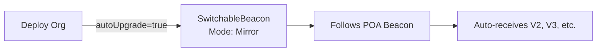
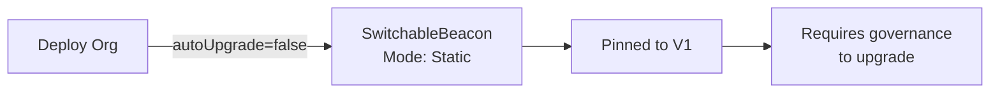

# SwitchableBeacon Architecture Documentation

## Table of Contents
1. [Overview](#overview)
2. [Architecture Design](#architecture-design)
3. [Core Components](#core-components)
4. [Deployment Flow](#deployment-flow)
5. [Mode Operations](#mode-operations)
6. [Governance Integration](#governance-integration)
7. [Technical Implementation](#technical-implementation)
8. [Security Considerations](#security-considerations)
9. [Gas Optimization](#gas-optimization)
10. [Usage Examples](#usage-examples)

## Overview

The SwitchableBeacon is a sophisticated upgrade management system that enables organizations to dynamically control how their smart contracts receive upgrades. It provides a flexible bridge between centralized protocol upgrades and decentralized organizational autonomy.

### Problem Statement

In a multi-organization protocol:
- The protocol team needs to push critical upgrades and improvements
- Organizations need autonomy to control when and if they adopt changes
- Switching between upgrade strategies should not require redeploying contracts
- The system must prevent dangerous proxy-to-proxy delegation chains

### Solution

SwitchableBeacon provides a dual-mode beacon that can:
- **Mirror Mode**: Automatically follow global protocol upgrades
- **Static Mode**: Pin to a specific implementation version

## Architecture Design

### System Topology

```
┌─────────────────────────────────────────────────────────────┐
│                     POA Protocol Level                       │
├─────────────────────────────────────────────────────────────┤
│                                                               │
│  ┌─────────────────┐     ┌─────────────────┐                │
│  │  POA Manager    │────>│ UpgradeableBeacon│                │
│  │                 │     │  (Global V2)     │                │
│  └─────────────────┘     └─────────────────┘                │
│                                 ▲                            │
└─────────────────────────────────┼────────────────────────────┘
                                  │ Mirror Mode
┌─────────────────────────────────┼────────────────────────────┐
│                     Organization Level                        │
├─────────────────────────────────┼────────────────────────────┤
│                                 │                            │
│  ┌──────────────┐      ┌────────┴──────────┐                │
│  │ BeaconProxy  │─────>│ SwitchableBeacon  │                │
│  │              │      │                    │                │
│  └──────────────┘      │  Mode: Mirror     │                │
│         │              │  or    Static     │                │
│         │              └───────────────────┘                │
│         │                       │                            │
│         │                       │ Static Mode                │
│         ▼                       ▼                            │
│  ┌──────────────┐      ┌──────────────┐                    │
│  │ Logic Impl   │      │ Pinned Impl  │                    │
│  │  (Current)   │      │    (V1)      │                    │
│  └──────────────┘      └──────────────┘                    │
│                                                              │
└──────────────────────────────────────────────────────────────┘
```

### Key Design Principles

1. **No Proxy Chains**: Beacons only return logic addresses, never proxy addresses
2. **Single Source of Truth**: Each beacon maintains clear ownership and state
3. **Atomic Transitions**: Mode switches happen in single transactions
4. **Governance Integration**: All changes go through organizational governance

## Core Components

### 1. SwitchableBeacon Contract

```solidity
contract SwitchableBeacon is IBeacon {
    enum Mode { Mirror, Static }
    
    address public owner;                  // Governance controller
    address public mirrorBeacon;           // POA global beacon
    address public staticImplementation;   // Pinned version
    Mode public mode;                      // Current operational mode
}
```

#### Key Functions

| Function | Description | Access |
|----------|-------------|--------|
| `implementation()` | Returns current implementation based on mode | Public View |
| `setMirror(address)` | Switch to Mirror mode with specified beacon | Owner Only |
| `pin(address)` | Pin to specific implementation | Owner Only |
| `pinToCurrent()` | Pin to current mirror beacon's implementation | Owner Only |
| `transferOwnership(address)` | Transfer beacon control | Owner Only |

### 2. Deployment Integration

The Deployer contract creates SwitchableBeacon instances for every module:

```solidity
function _deploy(...) internal returns (address proxy, address beacon) {
    // Determine mode based on autoUpgrade flag
    SwitchableBeacon.Mode beaconMode = autoUpgrade 
        ? SwitchableBeacon.Mode.Mirror 
        : SwitchableBeacon.Mode.Static;
    
    // Create SwitchableBeacon
    beacon = address(new SwitchableBeacon(
        moduleOwner,
        poaBeacon,
        initImpl,
        beaconMode
    ));
    
    // Create proxy pointing to beacon
    proxy = address(new BeaconProxy(beacon, ""));
}
```

## Deployment Flow

### Step-by-Step Organization Deployment

1. **Organization Creation**
   ```
   Deployer.deployFullOrg() called
   ├── Create org in bootstrap mode
   ├── Deploy Executor with temporary beacon ownership
   └── Continue with module deployments
   ```

2. **Module Deployment Pattern**
   ```
   For each module (QuickJoin, ParticipationToken, etc.):
   ├── Determine upgrade mode (auto/pinned)
   ├── Create SwitchableBeacon
   │   ├── If auto: Mode.Mirror, no static impl
   │   └── If pinned: Mode.Static, current V1 impl
   ├── Create BeaconProxy → SwitchableBeacon
   └── Register in OrgRegistry
   ```

3. **Ownership Transfer**
   ```
   After governance setup:
   ├── Transfer Executor's beacon → Executor itself
   ├── Other module beacons → Already owned by Executor
   └── Renounce Executor ownership → Governance only
   ```

### Deployment Scenarios

#### Scenario A: Auto-Upgrade Organization


#### Scenario B: Conservative Organization


## Mode Operations

### Mirror Mode Operation

When in Mirror mode, the beacon acts as a transparent proxy to the POA global beacon:

```solidity
function implementation() external view returns (address) {
    if (mode == Mode.Mirror) {
        address impl = IBeacon(mirrorBeacon).implementation();
        if (impl == address(0)) revert ImplNotSet();
        return impl;  // Returns POA's current implementation
    }
    // ... Static mode logic
}
```

**Characteristics:**
- Zero additional storage reads (just one external call)
- Automatic upgrade propagation
- No governance required for updates
- Minimal gas overhead (~2,100 gas for external call)

### Static Mode Operation

When in Static mode, the beacon returns its stored implementation:

```solidity
function implementation() external view returns (address) {
    if (mode == Mode.Static) {
        if (staticImplementation == address(0)) revert ImplNotSet();
        return staticImplementation;  // Returns pinned version
    }
}
```

**Characteristics:**
- Single storage read
- Complete upgrade isolation
- Explicit governance action required for changes
- Slightly lower gas cost than Mirror mode

### Mode Switching Flows

#### Flow 1: Auto → Pinned (Pin to Current)
```
1. Organization observes new POA upgrade
2. Governance proposal: "Pin to current stable version"
3. Execute: SwitchableBeacon.pinToCurrent()
4. Result: Locked to current version, ignores future POA upgrades
```

#### Flow 2: Pinned → Auto (Resume Following)
```
1. Organization wants latest features
2. Governance proposal: "Enable auto-upgrades"
3. Execute: SwitchableBeacon.setMirror(poaBeacon)
4. Result: Immediately gets latest version, follows future upgrades
```

#### Flow 3: Selective Upgrade (While Pinned)
```
1. Organization reviews specific POA version
2. Governance proposal: "Upgrade to V3 specifically"
3. Execute: SwitchableBeacon.pin(V3Implementation)
4. Result: Upgrades to V3 but remains in Static mode
```

## Governance Integration

### Ownership Model

```
Executor (Governance-Controlled)
    ├── Owns: Executor's SwitchableBeacon
    ├── Owns: QuickJoin's SwitchableBeacon
    ├── Owns: ParticipationToken's SwitchableBeacon
    ├── Owns: TaskManager's SwitchableBeacon
    └── Owns: All other module SwitchableBeacons
```

### Governance Execution

All beacon operations go through the Executor:

```solidity
// Governance proposal to pin current version
bytes memory pinCall = abi.encodeWithSignature("pinToCurrent()");
Executor.execute(switchableBeaconAddress, pinCall, 0);
```

### Security Model

1. **No Direct Access**: Beacons can only be modified through governance
2. **Atomic Operations**: Mode switches are single transactions
3. **Clear Audit Trail**: All changes emit events
4. **Fail-Safe Defaults**: Invalid states revert rather than returning zero

## Technical Implementation

### Storage Layout

The SwitchableBeacon uses efficient storage packing:

```solidity
// Storage slots:
// Slot 0: owner (20 bytes) + mode (1 byte) 
// Slot 1: mirrorBeacon (20 bytes)
// Slot 2: staticImplementation (20 bytes)
```

### Gas Optimization Techniques

1. **Custom Errors**: Save ~2,000 gas vs require strings
2. **Storage Packing**: Owner and mode in single slot
3. **Minimal Validation**: Only check critical invariants
4. **View Function Optimization**: Direct returns without intermediate variables

### Implementation Validation

The beacon validates implementations at critical points:

```solidity
function setMirror(address _mirrorBeacon) external onlyOwner {
    if (_mirrorBeacon == address(0)) revert ZeroAddress();
    
    // Validate beacon has valid implementation
    address impl = IBeacon(_mirrorBeacon).implementation();
    if (impl == address(0)) revert ImplNotSet();
    
    mirrorBeacon = _mirrorBeacon;
    mode = Mode.Mirror;
    // ... emit events
}
```

## Security Considerations

### Attack Vectors Mitigated

1. **Proxy-to-Proxy Delegation**
   - Beacons only return logic addresses
   - Prevents complex delegation chains
   - Eliminates proxy recursion risks

2. **Unauthorized Upgrades**
   - Owner-only modification functions
   - Governance-controlled ownership
   - Event emission for monitoring

3. **Implementation Corruption**
   - Zero-address validation
   - Implementation existence checks
   - Revert on invalid states

### Security Best Practices

1. **Access Control**: Strict ownership model with transfer capability
2. **Input Validation**: All addresses validated for zero
3. **State Consistency**: Mode and implementation kept in sync
4. **Fail-Safe Design**: Reverts preferred over undefined behavior
5. **Event Logging**: Comprehensive events for off-chain monitoring

## Gas Optimization

### Gas Costs Comparison

| Operation | Mirror Mode | Static Mode | Difference |
|-----------|------------|-------------|------------|
| `implementation()` | ~2,800 gas | ~700 gas | +2,100 gas |
| Storage | 3 slots | 3 slots | None |
| Deployment | ~420,000 gas | ~420,000 gas | None |

### Optimization Strategies

1. **Mode Checking**: Enum comparison is cheaper than address comparison
2. **Error Handling**: Custom errors save significant gas
3. **Storage Access**: Minimize repeated SLOAD operations
4. **External Calls**: Single external call in Mirror mode

## Usage Examples

### Example 1: Organization Deployment

```solidity
// Deploy organization with auto-upgrade enabled
(hybridVoting, executor, quickJoin, token, taskManager, educationHub) = 
    deployer.deployFullOrg(
        orgId,
        "MyDAO",
        registryAddr,
        true,  // autoUpgrade = true (Mirror mode)
        51,    // quorum
        votingClasses,
        roleNames,
        roleImages,
        roleCanVote
    );
```

### Example 2: Governance Proposal to Pin

```solidity
// In governance proposal execution
function pinCurrentVersion(address beaconAddress) external {
    require(msg.sender == hybridVoting, "Only governance");
    
    // Pin to current version
    SwitchableBeacon(beaconAddress).pinToCurrent();
    
    emit VersionPinned(beaconAddress);
}
```

### Example 3: Emergency Upgrade Response

```solidity
// If POA releases emergency fix
function handleEmergencyUpgrade() external {
    // If in Static mode, can quickly switch to Mirror
    if (!beacon.isMirrorMode()) {
        // Create governance proposal
        bytes memory payload = abi.encodeWithSignature(
            "setMirror(address)", 
            poaManager.getBeacon("Executor")
        );
        
        // Execute through governance fast-track
        executor.execute(address(beacon), payload, 0);
    }
    // Now automatically using emergency fix
}
```

### Example 4: Gradual Upgrade Adoption

```solidity
// Organization wants to test V2 before full adoption
function testAndAdoptUpgrade(address v2Implementation) external {
    // Step 1: Pin to specific V2 (still in Static mode)
    beacon.pin(v2Implementation);
    
    // Step 2: Run tests and verification
    require(runUpgradeTests(), "Tests failed");
    
    // Step 3: If satisfied, switch to auto-follow
    beacon.setMirror(poaGlobalBeacon);
}
```

## Migration Strategies

### For Existing Organizations

1. **Assess Current State**: Determine current implementation versions
2. **Deploy SwitchableBeacons**: Create new beacons in Static mode with current impl
3. **Update Proxies**: Point existing proxies to new SwitchableBeacons
4. **Transfer Ownership**: Move beacon control to governance
5. **Enable Features**: Gradually enable Mirror mode as needed

### For New Organizations

1. **Choose Strategy**:
   - Progressive: Start with Mirror mode for latest features
   - Conservative: Start with Static mode for stability
   
2. **Deploy with Preference**: Use `autoUpgrade` flag in deployment

3. **Configure Governance**: Ensure governance can control beacons

## Testing Strategies

### Unit Testing Coverage

```solidity
// Test mode transitions
function testMirrorToStaticTransition()
function testStaticToMirrorTransition()

// Test implementation tracking
function testMirrorFollowsUpgrades()
function testStaticIgnoresUpgrades()

// Test access control
function testOnlyOwnerCanSwitch()
function testOwnershipTransfer()

// Test edge cases
function testZeroAddressValidation()
function testInvalidImplementationHandling()
```

### Integration Testing

1. **Full Deployment**: Test complete org deployment with SwitchableBeacon
2. **Governance Flow**: Test proposal → execution → mode switch
3. **Upgrade Propagation**: Verify Mirror mode tracks POA upgrades
4. **Gas Measurements**: Confirm optimization targets met

## Monitoring and Maintenance

### On-Chain Monitoring

Track these events for beacon health:
- `ModeChanged`: Monitor mode switches
- `Pinned`: Track version pinning
- `MirrorSet`: Observe mirror beacon changes
- `OwnerTransferred`: Audit ownership changes

### Off-Chain Monitoring

1. **Version Tracking**: Compare org versions with POA latest
2. **Mode Distribution**: Analyze how many orgs use each mode
3. **Upgrade Velocity**: Track how quickly orgs adopt new versions
4. **Gas Usage**: Monitor actual gas costs in production

## Future Enhancements

### Potential V2 Features

1. **Allowlist Integration**: Validate implementations against POA allowlist
2. **Time-Delayed Upgrades**: Automatic upgrade after timelock
3. **Partial Upgrades**: Different modes for different modules
4. **Upgrade Incentives**: Rewards for staying current
5. **Emergency Pause**: Global pause for critical issues

### Scaling Considerations

1. **Batch Operations**: Update multiple beacons in one transaction
2. **Beacon Registry**: Central registry of all organization beacons
3. **Cross-Chain Support**: Coordinate upgrades across multiple chains
4. **Upgrade Notifications**: On-chain events for pending upgrades

## Conclusion

The SwitchableBeacon architecture provides a robust, flexible, and secure upgrade management system that balances protocol evolution with organizational autonomy. By enabling seamless transitions between automated and manual upgrade modes, it empowers organizations to adopt upgrades at their own pace while maintaining the ability to quickly respond to critical updates.

The system's design prioritizes:
- **Security**: Through strict access control and validation
- **Flexibility**: Via dual-mode operation
- **Efficiency**: With optimized gas usage
- **Transparency**: Through comprehensive event emission
- **Simplicity**: With clear, single-purpose functions

This architecture represents a significant advancement in decentralized upgrade management, providing the foundation for sustainable protocol evolution in multi-stakeholder environments.